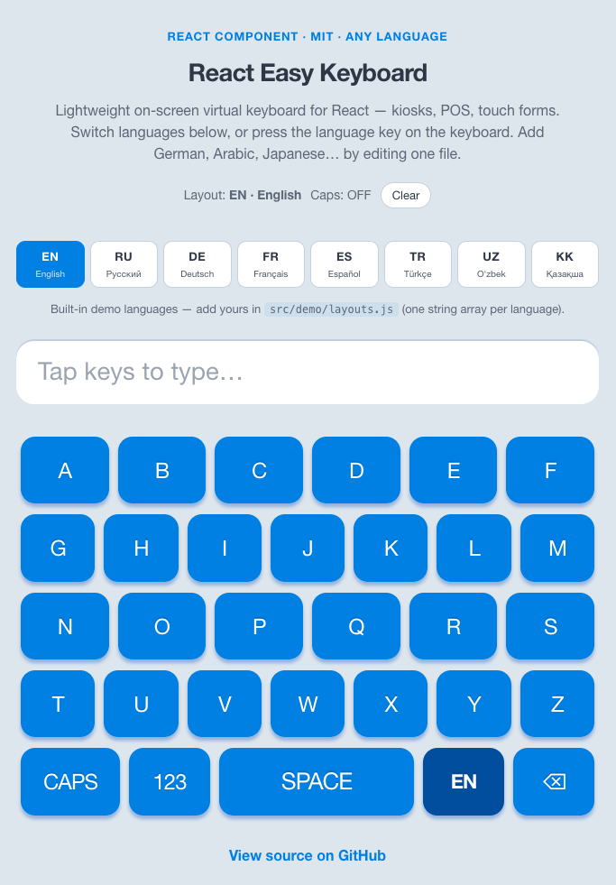

# React Easy Keyboard — on-screen virtual keyboard for React

[](LICENSE)
[](https://react.dev/)
[](https://vitejs.dev/)

**Экранная (виртуальная) клавиатура для React — для оборудования без физической клавиатуры.**

Lightweight, copy-paste React component for an on-screen (virtual / soft / touch) keyboard. Built for **devices and hardware that have no keyboard**: self-service terminals, industrial panels, tablets, touch monitors, and embedded UIs.

No heavy libraries. No native bindings. Define layouts as plain strings, style individual keys, and handle special actions in one callback. Ideal for **kiosks**, **POS / cash registers**, **vending machines**, **info desks**, **medical devices**, **factory HMIs**, and any touch form where a physical keyboard is missing or unusable.

> **Keywords:** react virtual keyboard · on-screen keyboard · touch keyboard · soft keyboard · keyboardless device · equipment without keyboard · kiosk keyboard · POS input · react keyboard component · custom keyboard layout · multilingual keyboard · English German French Spanish Turkish Russian Uzbek Kazakh keyboard · экранная клавиатура react · виртуальная клавиатура · оборудование без клавиатуры · қазақша пернетақта · deutsche Bildschirmtastatur · clavier virtuel react



---

## Why this project

Physical keyboards are often unavailable on the factory floor, at a checkout, or on a wall-mounted terminal. **React Easy Keyboard** gives you a simple touch keyboard you can embed and localize.

Most virtual keyboard packages are large, opinionated, or tied to a specific layout engine. This one stays minimal:

| | React Easy Keyboard | Typical alternatives |
|---|---|---|
| Dependencies | React only | Often jQuery, large UI kits, or native wrappers |
| Layout format | Simple string arrays | JSON schemas, config files, or fixed QWERTY |
| Styling | Per-key inline overrides | Theme systems or hard-coded CSS |
| Bundle | ~3 small components + CSS | Full keyboard engines |

You copy `src/on-screen-keyboard/` into your app (or fork the repo) and adapt layouts in minutes.

---

## Demo

**Live demo:** https://demos.gilazoff.com/keyboard/

```bash
git clone https://github.com/Pirantul/react-easy-keyboard.git
cd react-easy-keyboard
npm install
npm start
```

Open `http://localhost:5173` — switch languages with the chips (EN / RU / DE / FR / ES / TR / UZ / KK), or tap the language key on the keyboard to cycle. Numeric layout, caps, and backspace are included.

---

## Project structure

```
src/
├── on-screen-keyboard/     ← reusable component (copy this folder)
│   ├── OnScreenKeyboard.jsx
│   ├── KeyboardRow.jsx
│   ├── KeyboardKey.jsx
│   ├── on-screen-keyboard.css
│   └── index.js
├── demo/                   ← live demo app
│   ├── App.jsx
│   ├── useKeyboardInput.js ← example state + layout switching
│   ├── layouts.js          ← EN RU DE FR ES TR UZ KK + numeric
│   └── app.css
└── main.jsx
```

---

## Quick integration

### 1. Copy the component

Copy `src/on-screen-keyboard/` into your React project and import:

```jsx
import OnScreenKeyboard from "./on-screen-keyboard";
import "./on-screen-keyboard/on-screen-keyboard.css";
```

### 2. Define a layout

Each array item is one row. Keys in a row are separated by spaces:

```jsx
const layout = [
  "Q W E R T Y",
  "A S D F G H",
  "CAPS SPACE ⌫",
];
```

### 3. Handle key presses

```jsx
function SearchPanel() {
  const [query, setQuery] = useState("");

  const onKeyPress = (value) => {
    if (value === "⌫") {
      setQuery((q) => q.slice(0, -1));
      return;
    }
    if (value === "CAPS") return; // toggle caps in your state
    setQuery((q) => q + value);
  };

  return (
    <>
      <input readOnly value={query} />
      <OnScreenKeyboard layout={layout} onKeyPress={onKeyPress} />
    </>
  );
}
```

### 4. Style keys (optional)

```jsx
const keyStyle = {
  default: { fontSize: "28px", lineHeight: "72px" },
  keys: [
    { label: "SPACE", value: " ", style: { minWidth: "200px" } },
    { label: "CAPS", value: "CAPS", style: { minWidth: "80px", background: "#444" } },
    { label: "⌫", value: "⌫", style: { minWidth: "64px" } },
  ],
};

<OnScreenKeyboard layout={layout} keyStyle={keyStyle} onKeyPress={onKeyPress} />;
```

See `src/demo/useKeyboardInput.js` for a full example with **layout switching** (languages + numeric).

---

## Multilingual layouts — add any language

The component does **not** hard-code a language list. A layout is just an array of strings. The demo ships with:

| Code | Language | Space key label |
|------|----------|-----------------|
| EN | English | `SPACE` |
| RU | Русский | `ПРОБЕЛ` |
| DE | Deutsch | `LEER` |
| FR | Français | `ESPACE` |
| ES | Español | `ESPACIO` |
| TR | Türkçe | `BOŞLUK` |
| UZ | O'zbek | `BO'SH` |
| KK | Қазақша | `БОС` |
| 123 | Numeric pad | — |

### Switch language in the demo

1. **Language chips** above the keyboard (tap EN, RU, DE…)
2. **Language key** on the bottom row — shows the current code (`EN`, `RU`…) and cycles to the next language on each press

### Add your own language (e.g. Arabic, Polish, Japanese)

Edit `src/demo/layouts.js` — append one object to `ALPHA_LANGUAGES`:

```js
{
  id: "pl",
  code: "PL",
  name: "Polski",
  spaceLabel: "SPACJA",
  rows: [
    "A Ą B C Ć D E Ę",
    "F G H I J K L Ł",
    "M N Ń O Ó P R S",
    "Ś T U W Y Z Ź Ż",
    "CAPS 123 SPACJA LANG ⌫",
  ],
},
```

That’s it — the chip selector and the cycling `LANG` key pick it up automatically. No plugins, no i18n framework.

Tips:

- Put `LANG` in the last row; the demo replaces it with the live language code (`EN`, `PL`…)
- Localize the space key text (`SPACE`, `ПРОБЕЛ`, `ESPACE`…) — it still inserts `" "`
- For RTL scripts (Arabic, Hebrew), add the characters and optionally set `direction: "rtl"` on the keyboard container

---

## API

### `<OnScreenKeyboard />`

| Prop | Type | Required | Description |
|------|------|----------|-------------|
| `layout` | `string[]` | yes | Rows of space-separated key labels |
| `onKeyPress` | `(value: string) => void` | yes | Called when a key is clicked/tapped |
| `keyStyle` | `KeyStyleConfig` | no | Default and per-key styles |
| `className` | `string` | no | Extra class on the keyboard container |
| `ariaLabel` | `string` | no | Accessible name (default: `"On-screen keyboard"`) |

### `KeyStyleConfig`

```ts
{
  default?: React.CSSProperties;   // applied to every key
  keys?: Array<{
    label: string;                 // must match a label in layout
    value?: string;                // emitted value (default: label)
    style?: React.CSSProperties;
    className?: string;
    ariaLabel?: string;
  }>;
}
```

### Reserved values (convention)

The component does not interpret special keys — **you** handle them in `onKeyPress`. The demo uses these conventions:

| Key label | Typical `value` | Demo behavior |
|-----------|-----------------|---------------|
| `CAPS` | `"CAPS"` | Toggle caps lock |
| `123` | `"123"` | Switch to numeric layout |
| `abc` | `"abc"` | Back to letter layout |
| `EN` / `RU` / `DE`… (or `LANG`) | `"LANG"` | Cycle to the next language |
| `SPACE` / `ПРОБЕЛ` / `ESPACE`… | `" "` | Insert space |
| `⌫` or `<` | `"⌫"` | Backspace |

---

## Use cases

Built for **equipment and workplaces without a physical keyboard**:

- **Self-service kiosks** — order terminals, info desks, museum touch screens
- **POS / cash registers** — customer name entry, loyalty signup on a touch monitor
- **Industrial HMI / tablets** — warehouse, factory floor, gloved hands
- **Medical / lab devices** — sanitized touch input (no shared physical keyboard)
- **Vending / ticket machines** — on-device text and code entry
- **Kids / education apps** — simplified alphabetical layouts
- **Multilingual forms** — demo includes EN, RU, DE, FR, ES, TR, UZ, KK; add any language in one object
- **Password / PIN pads** — numeric layout with custom key sizes
- **Hotel / airport kiosks** — guests pick their language chip and type names in native script

---

## Custom layouts

### Numeric pad

```js
["1 2 3", "4 5 6", "7 8 9", "abc 0 ⌫"]
```

### Compact search bar (QWERTY-ish)

```js
["Q W E R T Y U I O P", "A S D F G H J K L", "⇧ Z X C V B N M ⌫", "123 SPACE GO"]
```

### German with umlauts (demo)

```js
["A B C D E F G", "H I J K L M N", "O P Q R S T U", "V W X Y Z Ä Ö Ü ß", "CAPS 123 LEER LANG ⌫"]
```

### Russian (demo)

```js
["А Б В Г Д Е Ё Ж", "З И Й К Л М Н О", "…", "CAPS 123 ПРОБЕЛ LANG ⌫"]
```

Any alphabet works: Latin, Cyrillic, Greek, Thai, Hangul — just put the characters into the string arrays.

---

## Accessibility

- Keys are native `<button type="button">` elements (keyboard-focusable, screen-reader friendly)
- `aria-label` on container and per-key overrides
- `:focus-visible` outline for keyboard navigation
- Demo output uses `aria-live="polite"` for typed text

---

## Scripts

| Command | Description |
|---------|-------------|
| `npm start` | Dev server (Vite) |
| `npm run build` | Production build → `dist/` |
| `npm run preview` | Preview production build |

Requires **Node.js 18+**.

---

## Tech stack

- React 18
- Vite 6
- Zero runtime dependencies beyond React

---

## Related searches

If you found this repo while looking for:

- *react on screen keyboard* / *react virtual keyboard component*
- *touch keyboard react* / *soft keyboard react*
- *javascript on screen keyboard for tablet*
- *kiosk keyboard react* / *POS terminal input*
- *custom keyboard layout react* / *multilingual virtual keyboard*
- *german french spanish turkish russian on-screen keyboard*
- *русская экранная клавиатура react* / *виртуальная клавиатура react*
- *deutsche Bildschirmtastatur* / *clavier virtuel react* / *teclado virtual react*

…this project is meant for exactly that — a small, readable starting point you can fork and extend.

---

## License

[MIT](LICENSE) — free for commercial and personal use.

---

## Author

[Pirantul](https://github.com/Pirantul) · Saint Petersburg, Russia

Contributions and issues welcome.
